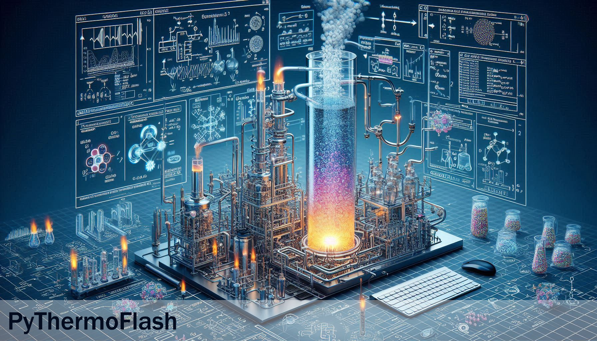

# 🧪 PyThermoFlash



    

PyThermoFlash is a powerful and user-friendly computational tool tailored for engineers, researchers, and scientists working with thermodynamic systems. It specializes in performing bubble-point, dew-point, and flash calculations, which are essential for determining the equilibrium state of mixtures under specified conditions. With support for various thermodynamic models, PyThermoFlash ensures accurate predictions of phase behavior and properties for complex fluid systems.

## 🔎 Thermodynamic Calculations in PyThermoFlash

### 🔵 Bubble-Point Pressure

The bubble-point pressure is the pressure at which the first bubble of vapor forms when heating a liquid mixture at constant temperature. It represents the equilibrium pressure where the liquid starts to vaporize at a given temperature and composition.

### 🔵 Bubble-Point Temperature

The bubble-point temperature is the temperature at which the first bubble of vapor appears when heating a liquid mixture at constant pressure. It marks the onset of vaporization under the specified pressure and composition.

### 🟠 Dew-Point Pressure

The dew-point pressure is the pressure at which the first drop of liquid condenses from a vapor mixture at a constant temperature. It defines the equilibrium pressure where condensation begins at the given temperature and vapor composition.

### 🟠 Dew-Point Temperature

The dew-point temperature is the temperature at which the first droplet of liquid forms when cooling a vapor mixture at constant pressure. It indicates the onset of condensation under the specified pressure and composition.

### ⚡ Isothermal Flash Calculation

The isothermal flash calculation determines the amounts and compositions of the vapor and liquid phases when a mixture partially vaporizes or condenses at a fixed temperature and pressure. This calculation is fundamental in process simulation, as it models phase equilibrium and phase splits for complex mixtures.

## 📚 Thermodynamic Models Supported

PyThermoFlash supports a variety of thermodynamic models to calculate phase equilibria, ranging from ideal to non-ideal mixtures.

### Supported Models:

- **📏 Raoult’s Law**: For ideal mixtures, Raoult’s law is used to calculate the vapor pressure of each component.
- **🔗 NRTL (Non-Random Two-Liquid Model)**: Suitable for non-ideal mixtures, especially those with strong intermolecular interactions.
- **🧪 UNIQUAC (Universal Quasi-Chemical Model)**: Ideal for systems with significant differences in molecular size or polarity.

## 📥 Installation

Install PyThermoFlash via pip:

```bash
pip install PyThermoFlash

import pyThermoFlash as ptf
```

### 🔗 Dependencies

PyThermoFlash depends on the `PyThermoModels` library for thermodynamic calculations. Ensure you have it installed:

Additionally, PyThermoFlash uses `PyThermoDB` as a reference for thermodynamic data. Make sure the required data files are available in your environment.

```bash
pip install PyThermoModels
pip install PyThermoDB
```

## 🧪 Examples

To get started with PyThermoFlash, you can explore the `tests` folder in the project directory. It contains various test scripts and configurations that demonstrate how to use the library for different thermodynamic calculations.

Additionally, visit the [Read the Docs](https://pythermoflash.readthedocs.io/en/latest/) page to familiarize yourself with the detailed documentation and calculation methods.

## 🤝 Contributing

Contributions are welcome! Please feel free to submit a Pull Request to improve the project.

## 📝 License

This project is licensed under the MIT License. You are free to use, modify, and distribute this software in your own applications or projects. However, if you choose to use this app in another app or software, please ensure that my name, Sina Gilassi, remains credited as the original author. This includes retaining any references to the original repository or documentation where applicable. By doing so, you help acknowledge the effort and time invested in creating this project.

## ❓ FAQ

For any questions, contact me on [LinkedIn](https://www.linkedin.com/in/sina-gilassi/).

## 👨‍💻 Authors

- [@sinagilassi](https://www.github.com/sinagilassi)
